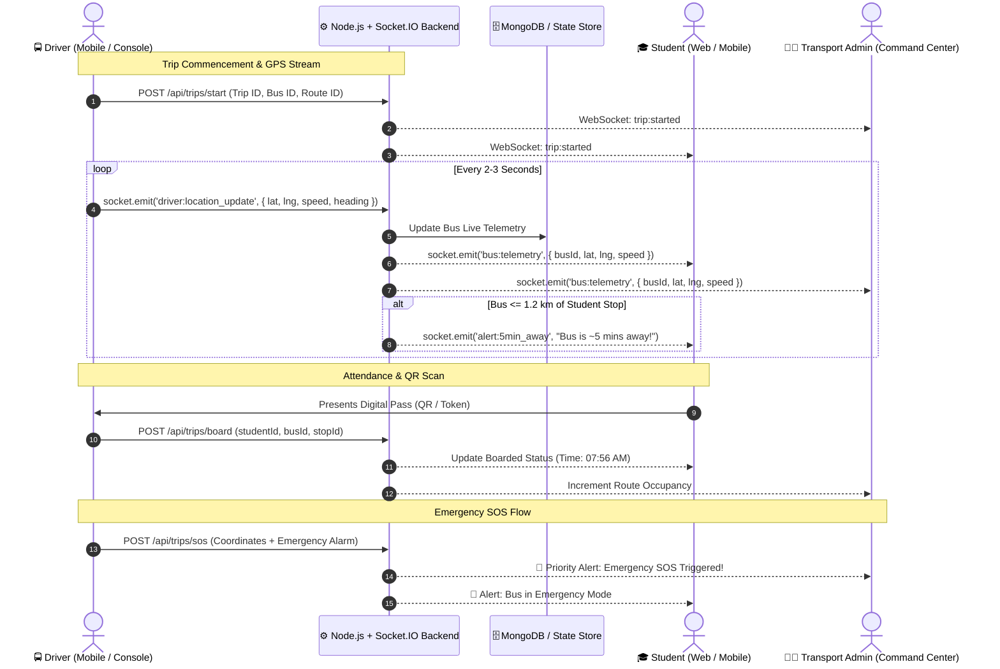

# 🚌 College Bus Management & Live GPS Tracking System (ApexTransit)

An end-to-end, enterprise-grade College Bus Management System with real-time GPS tracking, attendance logging, route management, SOS alerts, and role-based portals for **Students**, **Drivers**, and **Transporters / Admin**.

---

## 🛠️ Master Tech Stack Chart

| Layer | Chosen Technology | Role & Purpose | Why This Stack |
| :--- | :--- | :--- | :--- |
| **Student Portal** | **React (Web) / React Native** | Live bus map, ETA countdown, 5-min alert, attendance, route change & complaints | Fast, component-driven, responsive on mobile & desktop |
| **Driver Console** | **React / React Native** | Trip start/end, GPS stream, student boarding (QR/manual), delay reports & SOS | Native GPS support + simulation fallback with Socket.IO |
| **Admin Panel** | **React (Vite)** | Live all-fleet map, approvals, route builder, complaints resolution, push broadcasts | High-density dashboard with zero latency |
| **Backend Server** | **Node.js + Express.js** | REST API + WebSocket Server | Non-blocking I/O, event-driven, JavaScript everywhere |
| **Database** | **MongoDB (Atlas / Mongoose)** | Stores Users, Buses, Routes, Stops, Trips, Complaints | Flexible schema for geo-coordinates and stop sequences |
| **Real-Time Engine** | **Socket.IO / WebSockets** | Real-time GPS location streaming, instant SOS triggers, proximity alerts | Bi-directional streaming, sub-second latency |
| **Cloud & Auth** | **Firebase Auth + Firestore (Optional)** | Identity verification, push notifications (FCM), cloud sync | Cross-platform push notifications and token auth |
| **Mapping Engine** | **Leaflet + OpenStreetMap / CartoDB** | Interactive interactive map, route polylines, pulsing stops & custom bus icons | Free, lightweight, accurate, and completely configurable |
| **Styling & Design**| **Modern Vanilla CSS Design System** | Glassmorphism, dark luxury theme, responsive grids, animations | Ultra-fast load times, bespoke aesthetic, zero bloat |

---

## 🔄 End-to-End Architecture & Data Flow



---

## 🎯 Portals & Feature Breakdown

### 👨‍🎓 1. Student Portal
1. **Registration & College ID Onboarding**:
   - Register with College Roll Number / ID, Branch, Year, Phone, and Preferred Bus Stop.
   - Verification workflow through Admin Transport Desk.
2. **Dashboard**:
   - Assigned bus number, license plate, driver profile, rating, and direct phone link.
   - Assigned boarding stop, morning pickup time, and evening drop time.
   - Today's boarding status (Checked-in vs Awaiting Boarding).
3. **Live Bus Tracking**:
   - Interactive Leaflet map with real-time bus marker movement.
   - Dynamic ETA calculation based on real-time distance and vehicle velocity.
   - Automated **"5 Minutes Away"** warning banner.
4. **Digital Pass & QR Code**:
   - High-contrast college bus pass with dynamic QR token for fast boarding.
5. **Route Change Application**:
   - Request bus or stop reallocation with justification.
6. **Complaints & Grievance Desk**:
   - File reports on driver behavior, timings, AC/cleanliness, or overcrowding.
   - Track status (`Open`, `In Review`, `Resolved`) and read official Admin replies.

---

### 🚍 2. Driver Portal
1. **Trip Controller**:
   - Start Trip / End Trip controls with operational status broadcasting.
2. **Real-Time GPS Transmitter**:
   - **Auto-Drive Route Simulation**: Smoothly moves along waypoint stops with selectable speed (1x, 2x, 4x).
   - **Real Device GPS**: Uses HTML5 Geolocation (`watchPosition`) for actual mobile devices.
   - Speedometer, odometer, fuel %, and next stop indicators.
3. **Student Attendance Desk**:
   - QR Code camera scanner / token lookup.
   - Interactive passenger checklist with **1-Tap "Mark Boarded"**.
4. **Incident & Delay Reporting**:
   - Report heavy traffic (+10m, +15m, +25m delay) or vehicle breakdown.
   - Broadcasts immediate push notification to students at upcoming stops.
5. **Priority EMERGENCY SOS**:
   - Instant alarm beacon broadcasting GPS coordinates to Campus Police and Transport Dispatch.

---

### 🧑‍💼 3. Admin Command Center
1. **Transport Dashboard**:
   - Fleet KPIs: Active Buses on Route, On-Duty Drivers, Boarded Students Today, Attendance Rate %, Pending Actions.
   - Central **All-Fleet Live Map** visualizing all active buses and transit corridors concurrently.
2. **Bus & Driver Management**:
   - Register new buses, assign drivers, allocate routes, and toggle maintenance status.
3. **Route & Stop Management**:
   - View routes, stop coordinates, sequence order, morning pickup & evening drop timetables.
4. **Student Approvals Desk**:
   - Review and approve/reject pending student registrations.
5. **Complaints & Grievance Desk**:
   - Review submitted student grievances and post official administrative replies.
6. **Route Change Request Desk**:
   - Approve or reject relocation requests with automatic route re-assignment.
7. **Broadcast Notification Center**:
   - Dispatch custom push alerts (delays, weather warnings, emergency notices) to all students or specific routes.
8. **Reports & Analytics**:
   - Capacity utilization %, on-time arrival rate %, and driver performance ratings.

---

## 🚀 Running the Project Locally

### 1. Prerequisites
- **Node.js** v18+ (tested on v24.x)
- **npm** v9+

### 2. Start Backend Server
```bash
cd server
npm install
npm start
```
*Backend runs on `http://localhost:5000` (REST API & Socket.IO).*

### 3. Start Frontend Client
```bash
cd client
npm install
npm run dev
```
*Frontend runs on `http://localhost:5173`.*

---

## 🌐 Quick Role Switcher
In the frontend header bar, you can instantly switch between:
- **Student Side** (Alex Johnson / RT-01)
- **Driver Side** (Rajesh Kumar / Bus #01)
- **Admin Side** (Transport Command Center)
